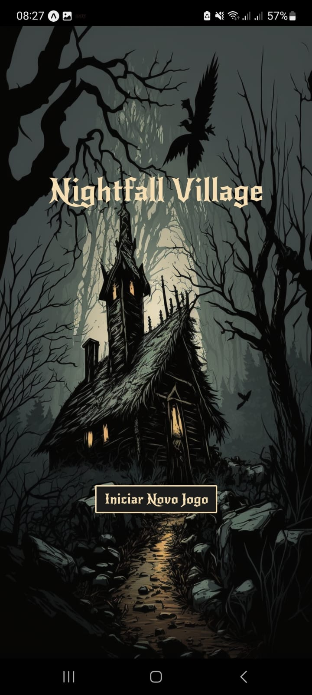

# Nightfall-Village
* Nighfall Village é um jogo para dispositivos móveis inspirado em "Lobisomem". O objetivo deste projeto é praticar desenvolvimento com React Native e enriquecer meu portfólio.
* O projeto está em constante evolução e tem como objetivo se tornar uma aplicação completa, com funcionalidades de multiplayer, personagens adicionais, além de aprimoramentos na jogabilidade e na interface gráfica.

# Principais Tecnologias utilizadas
* Expo: Plataforma para construção de aplicativos móveis utilizando React Native.
* React Native: Biblioteca JavaScript para criação de interfaces nativas em iOS e Android.
* React Navigation: Biblioteca para gerenciamento de rotas e navegação em aplicativos React Native.
* Styled Components: Biblioteca para criação de componentes estilizados em React e React Native.

# Como executar o projeto
* Clone o repositório: ```git clone https://github.com/CarlosDavidAraujo/Nightfall-Village.git```
* Entre no diretório do projeto: ```cd Nightfall-Village```
* Instale as dependências: ```npm install```
* Inicie o projeto: ```npx expo start ```
* Link para download do último APK funcional(eu acho): ```https://expo.dev/accounts/carlosdavid/projects/AwesomeProject/builds/38bc5fc8-6e4d-4f8c-b403-12e6ea6187af```

# Funcionalidades
* O jogo é jogado por uma comunidade de aldeões, com um ou mais jogadores agindo como lobisomens secretamente disfarçados.
* Cada jogador tem um conjunto de habilidades especiais que podem ser usadas para ajudar a identificar e eliminar os lobisomens, ou para ajudar os lobisomens a evitar a detecção e continuar a caçar os aldeões.
* O jogo é dividido em turnos, onde cada jogador pode usar uma habilidade por turno.
* O jogo termina quando todos os lobisomens ou todos os aldeões forem eliminados.

# ScreenShots

* Tela Inicial: advinha o que ela faz?


* Tela de seleção de jogadores: nesta tela é possível adicionar a quantidade de jogadores que irão participar e editar seus respectivos nomes


* Tela de seleção de jogadores: nesta tela é possível adicionar os papéis qu os jogadores irão assumir e suas respectivas quantidades, também é possível visualizar as informações sobre cada papél


* Fase da noite: onde o jogo inicia de fato, aqui os jogadores escolhem suas habilidades, após todos jogarem, a noite termina e é exibida uma mensagem com os acontecimentos


* Fase do dia: a partir daqui os jogadores terão um tempo para discutir quem eles desconfiam ser o lobisomem, em sequida irão votar em quem eliminar, após todos votarem é exibida uma mensagem sobre quem foi eliminado ou se algúem venceu o jogo, se ningúem venceu o jogo avança para o segundo turno


